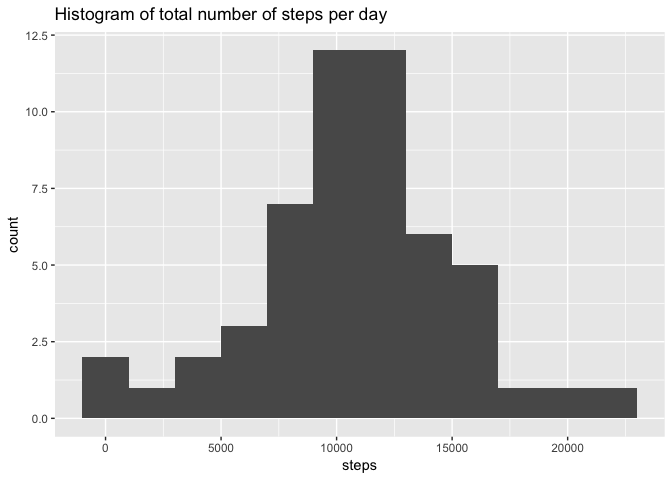
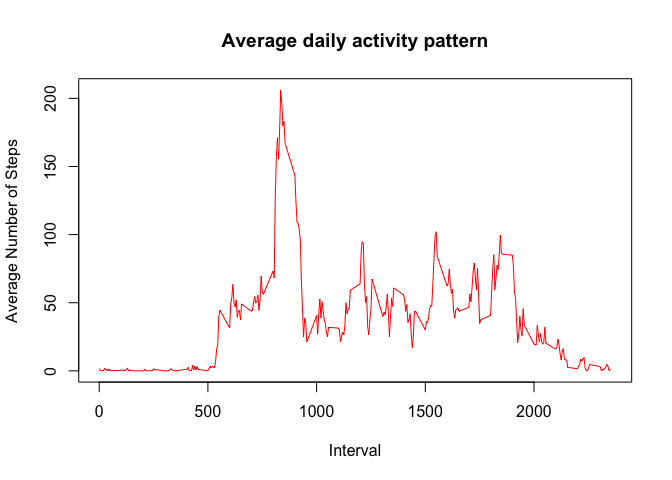
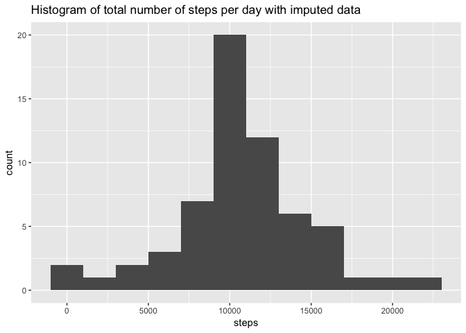
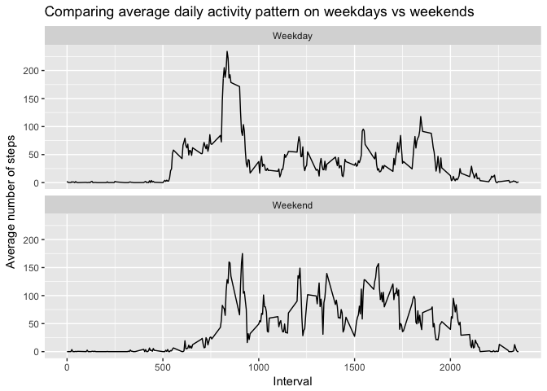

# Reproducable Research: Peer Assessment 1
Jeffrey Irvine  
2/6/2017  


## Installing required packages

```r
library(dplyr)
```

```
## 
## Attaching package: 'dplyr'
```

```
## The following objects are masked from 'package:stats':
## 
##     filter, lag
```

```
## The following objects are masked from 'package:base':
## 
##     intersect, setdiff, setequal, union
```

```r
library(ggplot2)
```

```
## Warning: package 'ggplot2' was built under R version 3.3.2
```

## Loading and preprocessing the data
Show any code that is needed to
1. Load the data (i.e. 𝚛𝚎𝚊𝚍.𝚌𝚜𝚟())
2. Process/transform the data (if necessary) into a format suitable for your analysis

```r
unzip("activity.zip")
activity <- read.csv("activity.csv")

#Remove NA Values
cleanActivity <- na.omit(activity)

head(cleanActivity)
```

```
##     steps       date interval
## 289     0 2012-10-02        0
## 290     0 2012-10-02        5
## 291     0 2012-10-02       10
## 292     0 2012-10-02       15
## 293     0 2012-10-02       20
## 294     0 2012-10-02       25
```

## What is mean total number of steps taken per day?
For this part of the assignment, you can ignore the missing values in the dataset.
1. Calculate the total number of steps taken per day

```r
StepsPerDay <- aggregate(steps ~ date, data = cleanActivity, sum)
```

2. If you do not understand the difference between a histogram and a barplot, research the difference between them. Make a histogram of the total number of steps taken each day

```r
qplot(steps,data = StepsPerDay, geom = "histogram", binwidth=2000, main = "Histogram of total number of steps per day")
```

<!-- -->

3. Calculate and report the mean and median of the total number of steps taken per day

```r
mean(StepsPerDay$steps, na.rm = TRUE)
```

```
## [1] 10766.19
```

```r
median(StepsPerDay$steps, na.rm = TRUE)
```

```
## [1] 10765
```

## What is the average daily activity pattern?
1. Make a time series plot (i.e. 𝚝𝚢𝚙𝚎 = "𝚕") of the 5-minute interval (x-axis) and the average number of steps taken, averaged across all days (y-axis)

```r
StepsPerInterval <- aggregate(steps ~ interval, cleanActivity, mean)

plot(StepsPerInterval$interval, StepsPerInterval$steps, type="l", xlab="Interval", ylab="Average Number of Steps", main="Average daily activity pattern", col="Red")
```

<!-- -->

2. Which 5-minute interval, on average across all the days in the dataset, contains the maximum number of steps?

```r
maxIntervalRow <- which.max(StepsPerInterval$steps)
StepsPerInterval [maxIntervalRow, ]
```

```
##     interval    steps
## 104      835 206.1698
```

## Imputing missing values
Note that there are a number of days/intervals where there are missing values (coded as 𝙽𝙰). The presence of missing days may introduce bias into some calculations or summaries of the data.

1. Calculate and report the total number of missing values in the dataset (i.e. the total number of rows with 𝙽𝙰s)

```r
sum(is.na(activity))
```

```
## [1] 2304
```

2. Devise a strategy for filling in all of the missing values in the dataset. The strategy does not need to be sophisticated. For example, you could use the mean/median for that day, or the mean for that 5-minute interval, etc.


```r
#replacing NA values with mean for corresponding 5-min interval
activityImputed <- activity
for (i in 1:nrow(activityImputed)) {
  if (is.na(activityImputed$steps[i])) {
    NAInterval <- activityImputed$interval[i]
    RowID <- which(StepsPerInterval$interval == NAInterval)
    StepsValue <- StepsPerInterval$steps[RowID]
    activityImputed$steps[i] <- StepsValue
  }
}
```

3. Create a new dataset that is equal to the original dataset but with the missing data filled in.

```r
summary(activityImputed)
```

```
##      steps                date          interval     
##  Min.   :  0.00   2012-10-01:  288   Min.   :   0.0  
##  1st Qu.:  0.00   2012-10-02:  288   1st Qu.: 588.8  
##  Median :  0.00   2012-10-03:  288   Median :1177.5  
##  Mean   : 37.38   2012-10-04:  288   Mean   :1177.5  
##  3rd Qu.: 27.00   2012-10-05:  288   3rd Qu.:1766.2  
##  Max.   :806.00   2012-10-06:  288   Max.   :2355.0  
##                   (Other)   :15840
```

4. Make a histogram of the total number of steps taken each day and Calculate and report the mean and median total number of steps taken per day. Do these values differ from the estimates from the first part of the assignment? What is the impact of imputing missing data on the estimates of the total daily number of steps?

```r
ImputedStepsPerDay <- aggregate(steps ~ date, data = activityImputed, sum)
qplot(steps,data = ImputedStepsPerDay, geom = "histogram", binwidth=2000, main = "Histogram of total number of steps per day with imputed data")
```

<!-- -->

```r
#mean and median of total steps per day in imputed dataset
mean(ImputedStepsPerDay$steps)
```

```
## [1] 10766.19
```

```r
median(ImputedStepsPerDay$steps)
```

```
## [1] 10766.19
```
**The mean is the same but the median increases slightly**

## Are there differences in activity patterns between weekdays and weekends?
For this part the 𝚠𝚎𝚎𝚔𝚍𝚊𝚢𝚜() function may be of some help here. Use the dataset with the filled-in missing values for this part.

1. Create a new factor variable in the dataset with two levels – “weekday” and “weekend” indicating whether a given date is a weekday or weekend day.


```r
cleanActivity$dayOfWeek <- weekdays(as.Date(cleanActivity$date))

cleanActivity$dayType <- c("Weekday")
for (i in 1:nrow(cleanActivity)){
  if (cleanActivity$dayOfWeek[i] == "Saturday" || cleanActivity$dayOfWeek[i] == "Sunday"){
    cleanActivity$dayType[i] <- "Weekend"
  }
}
cleanActivity$dayType <- as.factor(cleanActivity$dayType)
```

2. Make a panel plot containing a time series plot (i.e. 𝚝𝚢𝚙𝚎 = "𝚕") of the 5-minute interval (x-axis) and the average number of steps taken, averaged across all weekday days or weekend days (y-axis). See the README file in the GitHub repository to see an example of what this plot should look like using simulated data.

```r
StepsPerIntervalDayType <- aggregate(steps ~ interval+dayType, cleanActivity, mean)

qplot(interval, steps, data=StepsPerIntervalDayType, geom=c("line"), xlab="Interval", 
      ylab="Average number of steps", main="Comparing average daily activity pattern on weekdays vs weekends") + facet_wrap(~ dayType, ncol=1)
```

<!-- -->
